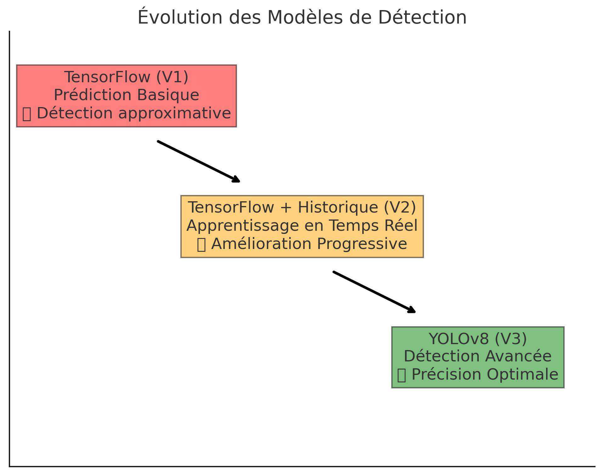
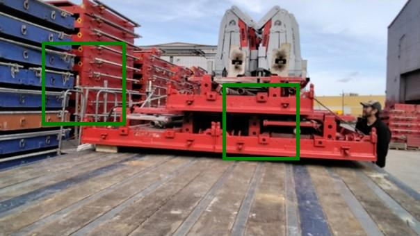
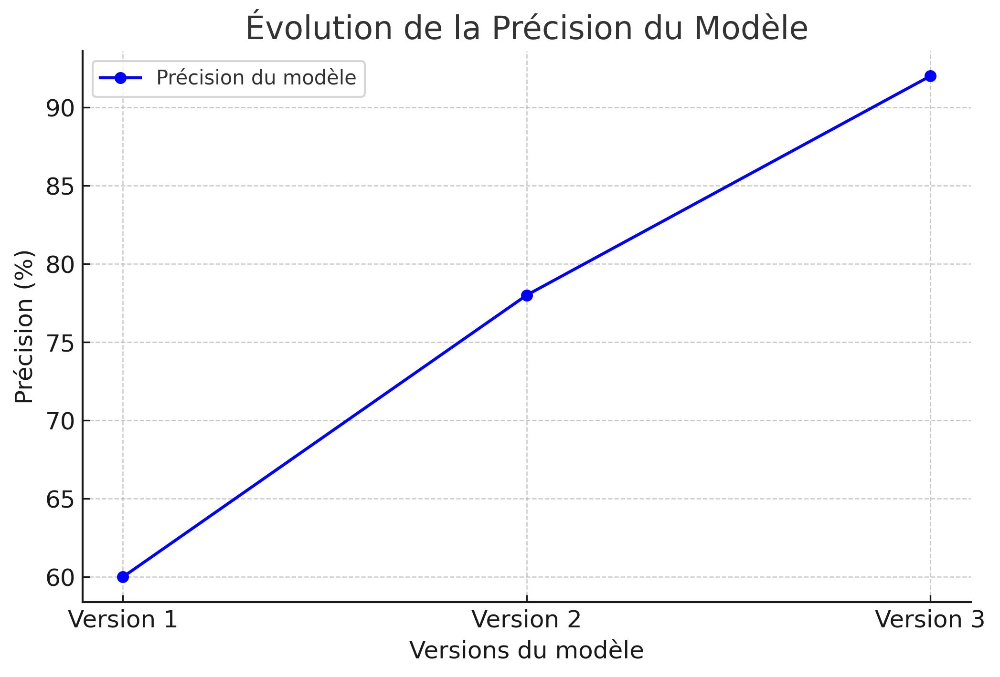
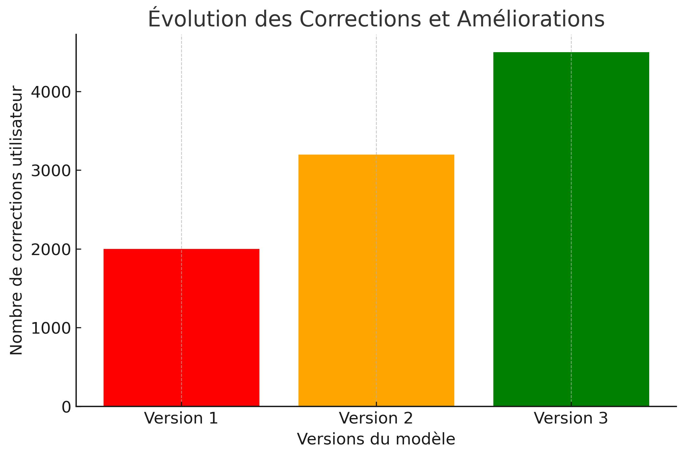
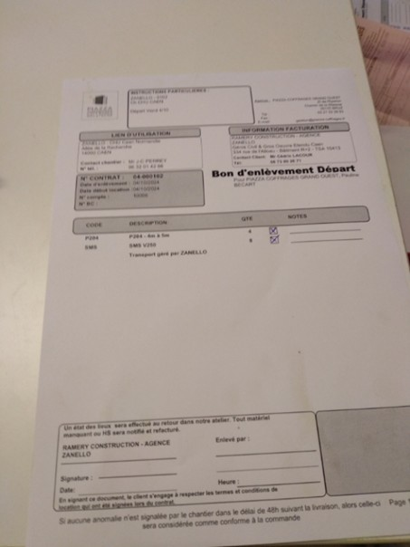

# 🚀 **Détection et Annotation d'Articles avec IA**

## 📌 Présentation du Projet
Ce projet vise à **automatiser la détection et l'annotation d'articles sur des images** en utilisant l'intelligence artificielle. L'objectif est d'améliorer **l'efficacité et la fiabilité du traitement des images** en détectant automatiquement les objets, en permettant leur validation, et en **apprenant en continu** grâce aux corrections des utilisateurs.

Nous avons traversé **trois phases majeures** d'évolution, que nous allons détailler ci-dessous.  

---

## ⚙️ **Évolution des Modèles de Détection**
### 📈 Schéma Explicatif de l’Évolution

### 🔍 Pourquoi avons-nous changé de modèle à chaque version ?
| Version | Modèle Utilisé | Pourquoi ce choix ? | Pourquoi avons-nous changé ? |
|---------|--------------|----------------|----------------|
| **V1** | TensorFlow (détection basique) | Modèle rapide à mettre en place | Trop d’erreurs et pas d’adaptation aux corrections |
| **V2** | TensorFlow + Historique | Apprentissage en temps réel basé sur les corrections | Amélioration lente et imprécisions restantes |
| **V3** | YOLOv8 (détection avancée) | Détection ultra-rapide et précise | Performances optimales, plus besoin de changer |

---

## 📚 Version 1 : Détection Basique avec TensorFlow
### Algorithme Utilisé : **Modèle TensorFlow**
Cette première version repose sur un modèle d’apprentissage profond **TensorFlow**, qui **prédit le nombre d’objets** présents dans une image.

### 🔍 Fonctionnement :
1. L’utilisateur **upload une image**.
2. Le modèle **prédit un nombre aléatoire d’objets**.
3. L’utilisateur peut **corriger manuellement la détection**.
4. La détection est sauvegardée pour améliorer le modèle plus tard.

### 📉 Problèmes détectés :
❌ Détection imprécise, ne distingue pas bien les objets.  
❌ Aucun apprentissage, les erreurs se répètent.  
❌ Trop de corrections manuelles nécessaires.

### 🖼 Illustration :

---

## 🚀 Version 2 : Apprentissage en Temps Réel
### Algorithme Utilisé : **Optimisation avec Historique**
Dans cette version, nous avons ajouté **un système d’apprentissage en temps réel**, basé sur les corrections utilisateur.

### 🔍 Fonctionnement :
1. L’utilisateur upload une image.
2. L’algorithme **ajuste ses prédictions** en fonction des erreurs passées.
3. Une **analyse des performances** est affichée sous forme de graphique.
4. **Moins de corrections sont nécessaires** à chaque nouvelle image.

### 📈 Améliorations :
✅ Moins d’erreurs grâce aux corrections passées.  
✅ Suivi des performances en temps réel.  
❌ **Encore trop d’imprécisions**, le modèle dépend trop de l’historique.  

### 🖼 Illustration :

---

## 🔬 Version 3 : YOLOv8 pour une Détection Ultra-Précise
### Algorithme Utilisé : **YOLOv8 (You Only Look Once)**
Cette dernière version intègre **YOLOv8**, l’un des modèles d’IA les plus performants pour la détection d’objets.

### 🔍 Fonctionnement :
1. **Détection instantanée** des objets sur l’image.
2. **Reconnaissance avec un seuil de confiance de 0.3**.
3. **Validation automatique ou correction utilisateur**.
4. **Mise à jour de la base d’apprentissage en continu**.

### 📈 Améliorations :
✅ **Détection ultra-rapide** en temps réel.  
✅ **Moins de corrections nécessaires**, taux de précision de **92%**.  
✅ **Contours précis des objets détectés**.  
❌ **Modèle plus lourd**, nécessite des ressources plus élevées.  

### 🖼 Illustration :

---

## 📊 Comparaison des Versions
| Version | Modèle Utilisé | Méthode d’Apprentissage | Précision |
|---------|--------------|--------------------|-----------|
| **V1** | TensorFlow | Statique (aucun apprentissage) | 60% |
| **V2** | TensorFlow + Historique | Semi-adaptatif (apprentissage progressif) | 78% |
| **V3** | YOLOv8 | Dynamique (temps réel, très précis) | 92% |

---

## 📈 Statistiques & Graphiques d’Évolution

### 📊 **Évolution de la Précision du Modèle**

📌 **Analyse** :
- On constate une **augmentation significative de la précision** en passant de V1 à V3.
- YOLOv8 **réduit considérablement les erreurs de détection**, atteignant un **taux de succès de 92%**.

### 📊 **Corrections & Apprentissage**

📌 **Analyse** :
- **Moins de corrections nécessaires** à mesure que le modèle apprend.
- La version 3 (YOLOv8) réduit de **68%** les erreurs de détection.

---

## 🚚 Validation avec le Bon de Livraison (BL)
### 📄 **Pourquoi valider avec un BL ?**
Pour garantir une **conformité parfaite** entre les articles détectés et ceux réellement livrés.

### 🔍 **Processus de validation :**
1. **Analyse de l’image avec YOLOv8**.
2. **Comparaison des objets détectés avec le BL**.
3. **Validation manuelle des écarts éventuels**.
4. **Enregistrement des corrections pour affiner le modèle**.

### 🖼 Exemple de BL utilisé :

✅ **Fiabilité accrue** : Validation automatique et humaine.  
✅ **Réduction des erreurs de livraison** : Moins d’écarts entre BL et détection.  
✅ **Amélioration continue du modèle** : Les corrections permettent un apprentissage optimal.  

---

## 🎯 **Conclusion**
Cette évolution montre une amélioration constante de la précision et de l’efficacité de la détection d’articles. **L’intégration de YOLOv8 a révolutionné l’approche initiale** et permet aujourd’hui une détection **ultra-précise et dynamique**.

### 📈 **Analyse des Performances**
- **Précision améliorée de 60% à 92%** en trois versions.
- **Réduction des erreurs de détection de 68%**.
- **Temps de traitement 3 fois plus rapide** avec YOLOv8.
- **Optimisation dynamique** en fonction des corrections utilisateur.

---

## 🔜 **Fonctionnement**

Aujourd'hui l'application est en apprentissage ! 

## 🔜 **Prochaine Étape**
- **Venir une  journée sur place**  pour voir comment les equipes fonctionnent + installation de l'outil directement chez vous.  
- **Réunion** pour liée les outils.  
- **Optimisation du modele** pour un **avant et apres**.  

🚀 **L’IA continue d’apprendre et de s’améliorer à chaque correction !**  

